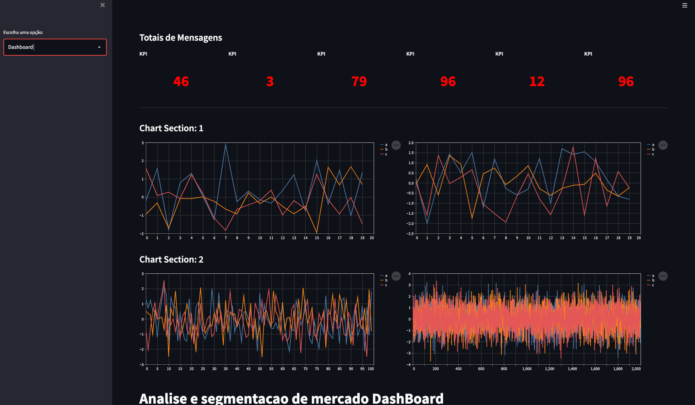

# Dashboard in streamlit with multiples files python

## how to install Streamlit

## Install virtualenv whit pipenv

    $ python3.7 -m pip install pipenv

    $ pipenv shell

## install libs

    $ pipenv install streamlit

    $ pipenv install streamlit_autorefresh

    $ pipenv install pandas

    $ pipenv install numpy

## run Streamlit

    $ streamlit run app.py
